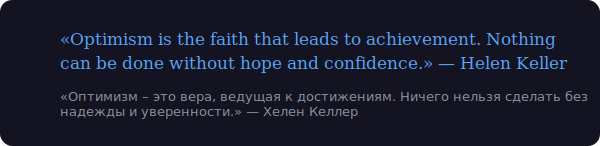

  

  

## 💭 Quote of the day:
<!-- DAILY_QUOTE_START -->

  

<!-- DAILY_QUOTE_END -->

## 📃 Weekly definition:
<!-- WEEKLY_TERM_START -->

  <blockquote>
    <strong>Term: Framework</strong>
 <small><strong>Description:</strong> A reusable, extensible set of libraries or classes that provide a foundation for developing applications.</small>
 <small><strong>Translate(RU):</strong> Фреймворк — многократно используемый и расширяемый набор библиотек или классов, предоставляющий основу для разработки приложений.</small>
 <small><strong>Reference:</strong> <a href="https://en.wikipedia.org/wiki/Software_framework" target="_blank">Learn more</a></small>
 
 <pre><code>// ASP.NET Core — пример фреймворка для веб-приложений на C#</code></pre>
<!-- Updated: 2026-04-26 -->
  </blockquote>

<!-- WEEKLY_TERM_END -->

## 🛠️ Tools:

  
  
  
   
   
   
   

## 📊 Stats:

## 📈 Streak:

    

## 🚀 Projects:

  
  
  
  
  
  

## 📫 Contact:

  
  

